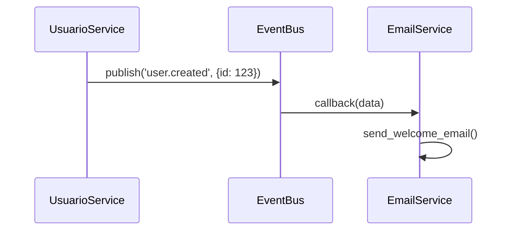

# Core Utils

Common elements for applications and projects.

## 1. Complete Configuration for Integrating `dj_core_utils`

### 1.1 Recommended Configuration Structure

`settings.py` of your main application (extending CoreSettings):

```python
from pathlib import Path
from dj_core_utils.settings.base import CoreSettings
import os
from datetime import timedelta

class MyAppSettings(CoreSettings):
    SERVICE_NAME = "users"
    IS_MICROSERVICE = os.getenv("IS_MICROSERVICE", "False") == "True"
    SERVICE_API_KEY = os.getenv("SERVICE_API_KEY")

    DATABASES = {
        'default': {
            **CoreSettings.DATABASES['default'],
            'NAME': os.getenv('DB_NAME', 'users_db'),
            'OPTIONS': {'options': '-c search_path=users,public'}
        }
    }

    INSTALLED_APPS = CoreSettings.INSTALLED_APPS + [
        'django.contrib.admin',
        'django.contrib.sessions',
        'django.contrib.messages',
        'django.contrib.staticfiles',
        'my_app',
    ]

    MIDDLEWARE = CoreSettings.MIDDLEWARE + [
        'django.middleware.security.SecurityMiddleware',
        'django.contrib.sessions.middleware.SessionMiddleware',
        'django.middleware.common.CommonMiddleware',
        'django.middleware.csrf.CsrfViewMiddleware',
        'django.contrib.auth.middleware.AuthenticationMiddleware',
        'django.contrib.messages.middleware.MessageMiddleware',
        'django.middleware.clickjacking.XFrameOptionsMiddleware',
        'corsheaders.middleware.CorsMiddleware',
    ]

    ROOT_URLCONF = 'my_project.urls'
    STATIC_URL = '/static/'
    STATIC_ROOT = os.path.join(BASE_DIR, 'staticfiles')

    SIMPLE_JWT = {
        **CoreSettings.SIMPLE_JWT,
        'ACCESS_TOKEN_LIFETIME': timedelta(minutes=120),
    }

    from django_core_utils.settings.cors import get_cors_settings
    CORS_ALLOWED_ORIGINS = get_cors_settings('my_app')['CORS_ALLOWED_ORIGINS']

for setting_name in dir(MyAppSettings):
    if setting_name.isupper():
        setting_value = getattr(MyAppSettings, setting_name)
        globals()[setting_name] = setting_value
```

### 1.2 Complete .env File

```env
DJANGO_SECRET_KEY=your_unique_and_complex_secret_key
DEBUG=True
ALLOWED_HOSTS=localhost,127.0.0.1

DB_NAME=my_project_db
DB_USER=postgres
DB_PASSWORD=postgres
DB_HOST=localhost
DB_PORT=5432

SERVICE_API_KEY=internal_service_secret_key
JWT_ALGORITHM=HS256

CORS_ALLOWED_ORIGINS=http://localhost:3000,http://127.0.0.1:3000
LOG_LEVEL=INFO

# Optional Production Config
# DJANGO_SETTINGS_MODULE=config.settings.production
# DATABASE_URL=postgres://user:password@db:5432/prod_db
```

### 1.3 Recommended Directory Structure

```
my_project/
├── .env
├── manage.py
├── my_project/
│   ├── __init__.py
│   ├── settings.py
│   ├── urls.py
│   └── wsgi.py
├── apps/
│   └── my_app/
└── requirements/
    ├── base.txt
    └── local.txt
```

### 1.4 Adjusted manage.py

```python
#!/usr/bin/env python
import os
import sys
from dotenv import load_dotenv

def main():
    load_dotenv()
    os.environ.setdefault('DJANGO_SETTINGS_MODULE', 'my_project.settings')
    try:
        from django.core.management import execute_from_command_line
    except ImportError as exc:
        raise ImportError("Couldn't import Django") from exc
    execute_from_command_line(sys.argv)

if __name__ == '__main__':
    main()
```


## 2. Release 

```bash
# Navigate to the package directory
cd /path/to/core_utils

# Install build tools (only the first time)
pip install --upgrade build wheel

# Build the wheel package
python -m build --wheel
```
```bash
core_utils/dist/
├── dj_core_utils-0.1.0-py3-none-any.whl
└── dj_core_utils-0.1.0.tar.gz
```
### 2.1 Installing the Wheel in Services

```bash
pip install /path/to/core_utils/dist/django_core_utils-0.1.0-py3-none-any.whl
```

### 2.2 Best Practices for Versioning
Use semantic versioning (MAJOR.MINOR.PATCH):

1. 1.0.0 for the first stable version

   - 0.1.0 for initial development
2. Update the version in pyproject.toml before each build

3. For pre-releases:

   - version = "1.0.0rc1" # Release candidate

The .env.example file contains the variables needed by the package that uses core_utils.

### 2.3 To Create a Release:

```bash
git tag -a v1.0.0 -m "Version 1.0.0"
git push origin v1.0.0
```
The workflow will run automatically, creating a release on GitHub and publishing the package on GitHub Packages.

#### 2.3.1 Installation from Other Projects:

```bash
pip install django-core-utils --extra-index-url https://raw.githubusercontent.com/your-username/core-utils/main/simple/

```

## 3. Extras

### 3.1 To Use the Audit Log
In apps.py of your main app:

```python
from django.apps import AppConfig

class CoreConfig(AppConfig):
    name = 'core'
    
    def ready(self):
        # Import signals to register them
        import django_core_utils.signals.audit  # noqa
        
        # Initialize the event bus if necessary
        from django_core_utils.events import local_bus
        local_bus.event_bus = local_bus.LocalEventBus()
```

### 3.2 Example of Using the Package with Microservices in Mind:
Communication Flow Between Services (Example):
Monolithic Mode:
```python
# In products/views.py
from user_service.models import User  # Direct import

def get_user_products(request, user_id):
    user = User.objects.get(pk=user_id)  # Direct model access

```
Microservices Mode:
```python
# In products/views.py
from dj_core_utils.api.client import APIClient

def get_user_products(request, user_id):
    client = APIClient('users')
    user = client.get(f'users/{user_id}/')  # HTTP call
```

### 3.3 Integrated with DRF and ViewSet (Example):

```python
# user_service/views.py
from rest_framework import viewsets
from rest_framework.response import Response
from dj_core_utils.api.client import APIClient
from dj_core_utils.api.exceptions import APIClientError
from django.conf import settings

class UserOrdersViewSet(viewsets.ViewSet):
    """
    ViewSet to handle user orders in both modes (monolith/microservices)
    """
    
    def list(self, request, user_id=None):
        try:
            if settings.IS_MICROSERVICE:
                client = APIClient('orders')
                orders = client.get(f'orders/?user_id={user_id}')
            else:
                from order_service.models import Order
                orders = list(
                    Order.objects.filter(user_id=user_id)
                    .values('id', 'date', 'total')
                )
            
            return Response(orders)
            
        except APIClientError as e:
            return Response(
                {'error': str(e)},
                status=e.status_code or 400
            )

# user_service/urls.py
from rest_framework.routers import DefaultRouter
from .views import UserOrdersViewSet

router = DefaultRouter()
router.register(r'users/(?P<user_id>[^/.]+)/orders', 
                UserOrdersViewSet, 
                basename='user-orders')
```

### 3.4 To Integrate Core Models

```python
from dj_core_utils.db.models import UserTrackedModel, StatusMixin
from django.db import models

class ModelName(UserTrackedModel, StatusMixin):
    user_id = models.UUIDField(db_index=True)
    total = models.DecimalField(max_digits=10, decimal_places=2)
    
    class Meta:
        db_table = 'ModelName'
```

## 4. LocalEventBus

About LocalEventBus (Event Bus Pattern)
What is it and what is it for?

The LocalEventBus is a simplified implementation of the Event Bus pattern designed for:

1. Communication between modules in your monolith
2. Preparation for microservices (future migration)
3. Decoupling components

How does it work?

- Publishing: Stores events in Django's cache
- Subscription: Retrieves events and executes callbacks

Practical Use Cases

```python
# In user_service/views.py
from dj_core_utils.events.local_bus import local_bus
from django.utils import timezone

def create_user(request):
    user = User.objects.create(...)
    
    # Publish event
    event_bus.publish(
        event_type='user.created',
        data={
            'id': user.id,
            'email': user.email,
            'timestamp': str(timezone.now())
        }
    )

```
Subscribe to Events

```python
# In notification_service
::contentReference[oaicite:0]{index=0}
 ```


## 5. About SECRET_KEY

¿How many times should be configured? 

Monolithic: just need only one SECRET_KEY shared between all modules.
Microservices: Every service should have their own key.

Best practices

1. Generation:

```bash
python -c "from django.core.management.utils import get_random_secret_key; print(get_random_secret_key())"
```

2. .env (example):

```bash
# Monolithics (Shared key)
DJANGO_SECRET_KEY=tu_clave_generada

# Microservices (independent)
USERS_SECRET_KEY=clave_usuarios
PRODUCTS_SECRET_KEY=clave_productos
```
3. Configuration by service:

```python
# settings.py each service
SECRET_KEY = os.getenv('USERS_SECRET_KEY')  # o PRODUCTS_SECRET_KEY
```



## 6. Integration with FastAPI

.env have shared information:

```env

# Shared configuration
DJANGO_SECRET_KEY=tu_clave_super_secreta
SERVICE_API_KEY=clave_servicios_internos
ENABLE_FASTAPI=True

# FastAPI configuration
FASTAPI_HOST=0.0.0.0
FASTAPI_PORT=8001
```

### 6.1.1 To install only the core dependencies (without FastAPI):

package:
```bash
pip install django-core-utils 
```
local:
```bash
pip install -e .
```
or

### 6.1.2 To install with FastAPI dependencies (optional group):
```bash
pip install "django-core-utils[fastapi]"
```
local:
```bash
pip install -e .[fastapi]
```

### 6.1.3 To install EVERYTHING (main + fastapi + dev):

```bash
pip install "django-core-utils[fastapi,dev]"
```
local:

```bash
pip install -e ".[fastapi,dev]
```

### 6.2 Use cases:

```python
FastAPI (main.py):

from fastapi import FastAPI, Depends
from dj_core_utils.fastapi.auth import jwt_auth, UserPayload
from dj_core_utils.fastapi.utils import django_to_pydantic
from django.contrib.auth import get_user_model

app = FastAPI()
User = get_user_model()

@app.get("/users/{user_id}")
async def get_user(
    user_id: int,
    current_user: UserPayload = Depends(jwt_auth)
):
    """Endpoint protected with django models"""
    if not current_user.is_staff and current_user.id != user_id:
        raise HTTPException(
            status_code=403,
            detail="You do not have permission to view this user"
        )

    user = User.objects.get(pk=user_id)
    return django_to_pydantic(user, UserPayload)
```

## 6.3 OperationLog Implementation

```python
from dj_core_utils.db.models import OperationLog
from dj_core_utils.fastapi.schemas import OperationLogSchema

# Convertion to Schema
log = OperationLog.objects.first()
log_schema = model_to_schema(log, OperationLogSchema)

# Creation from schema
new_log_data = OperationLogSchema(
    model_changed="Order",
    id_instance=1,
    operation_type="create",
    changes={"field": "value"}
)
new_log = schema_to_model(new_log_data, OperationLog)
new_log.user = request.user
new_log.save()
```

## 6.3.1 Django model example and usage

```python
# models.py
from django.db import models
from dj_core_utils.db.models import UserTrackedModel, StatusMixin

class Product(UserTrackedModel, StatusMixin):
    name = models.CharField(max_length=100)
    price = models.DecimalField(max_digits=10, decimal_places=2)
    
    class Meta:
        db_table = 'products'

# Use in views/endpoints
from django_core_utils.fastapi.schemas import TrackedSchema
from django_core_utils.fastapi.utils import model_to_schema, schema_to_model

# Instance creation
product_data = TrackedSchema(
    name="New Product",
    price=99.99,
    status=Status.ACTIVE
)
new_product = schema_to_model(product_data, Product)
new_product.created_by = request.user
new_product.save()

# Get instance
product = Product.objects.first()
product_schema = model_to_schema(product, TrackedSchema)
```

### 6.4 FastAPI → Django Communication (Example: JWT Authentication)

```python
# fastapi_app/auth.py
from fastapi import APIRouter, Depends, HTTPException
from .dependencies import jwt_auth, UserPayload
from django.contrib.auth import get_user_model
from dj_core_utils.fastapi.schemas import UserSchema
from dj_core_utils.fastapi.utils import model_to_schema

router = APIRouter()
User = get_user_model()

@router.get("/django-user/", response_model=UserSchema)
async def get_django_user(
    user_payload: UserPayload = Depends(jwt_auth)
):
    """Get users from Django"""
    try:
        django_user = User.objects.get(pk=user_payload.id)
        return model_to_schema(django_user, UserSchema)
    except User.DoesNotExist:
        raise HTTPException(status_code=404, detail="User not found in Django")

@router.post("/django-user/update-email/")
async def update_django_user_email(
    new_email: str,
    user_payload: UserPayload = Depends(jwt_auth)
):
    """Update email in Django from FastAPI"""
    user = User.objects.get(pk=user_payload.id)
    user.email = new_email
    user.save()
    
    # publish event
    await event_bus.publish(
        event_type="user_updated",
        data={
            "id": user.id,
            "email": new_email,
            "action": "email_update"
        }
    )
    return {"status": "Email updated"}

```
 
### 6.5 Real-Time Synchronization (WebSockets)

```python
# fastapi_app/websockets.py
from fastapi import WebSocket
from .event_bus import event_bus

class WebSocketManager:
    def __init__(self):
        self.connections = []
    
    async def connect(self, websocket: WebSocket):
        await websocket.accept()
        self.connections.append(websocket)
    
    async def broadcast(self, message: dict):
        for connection in self.connections:
            await connection.send_json(message)

manager = WebSocketManager()

# Subscribe to Django events
@event_bus.subscribe("model_updated")
async def handle_model_update(data: dict):
    """Notify WebSocket clients about changes in Django"""
    await manager.broadcast({
        "event": data.get("event_type"),
        "data": data
    })

# En Django:
# django_app/signals.py
@receiver(post_save, sender=YourModel)
def notify_model_update(sender, instance, **kwargs):
    event_bus.publish(
        event_type="model_updated",
        data={
            "model": sender.__name__,
            "id": instance.id,
            "changes": instance.get_changes()
        }
    )
```
 
## 7. AuditLog Implementation Django

### 7.1 Step-by-Step Implementation

1. Create the audit signal handler
Create a new file named audit_signals.py in one of your Django apps (e.g., core, common, or your_app):

```bash
your_app/
├── audit_signals.py  👈  ← create this
├── models.py
├── ...
```

2. Ensure OperationLog model exists
In models.py of any app (e.g., core.models), define the model that will store the audit logs:

3. Make sure get_current_user() works
Your code uses get_current_user() from dj_core_utils.middleware.context. That function should retrieve the currently authenticated user (usually stored in thread-local storage by custom middleware).
If you don't have it implemented yet, let me know — I can generate that middleware for you too.

4. Register your signals in apps.py
In the app where you created audit_signals.py, make sure to import it in the AppConfig:

```python
# your_app/apps.py
from django.apps import AppConfig

class YourAppConfig(AppConfig):
    name = 'your_app'

    def ready(self):
        import your_app.audit_signals  # ensures signal handlers are registered
```

Then in settings.py, update INSTALLED_APPS to use this config class:

```python
INSTALLED_APPS = [
    'your_app.apps.YourAppConfig',
    ...
]
```

### 7.2 Test it!

Use the Django shell or admin to:
```python
r1 = Role.objects.create(name="Admin")
user = UserProfile.objects.create(username="Joaquin")

user.roles.add(r1)   # triggers m2m_post_add
user.roles.remove(r1)  # triggers m2m_post_remove
user.roles.clear()   # triggers m2m_post_clear

user.username = "Joaco"
user.save()  # triggers post_save

user.delete()  # triggers post_delete
```